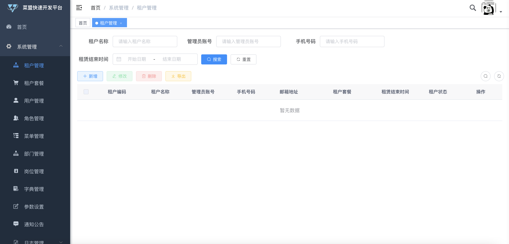
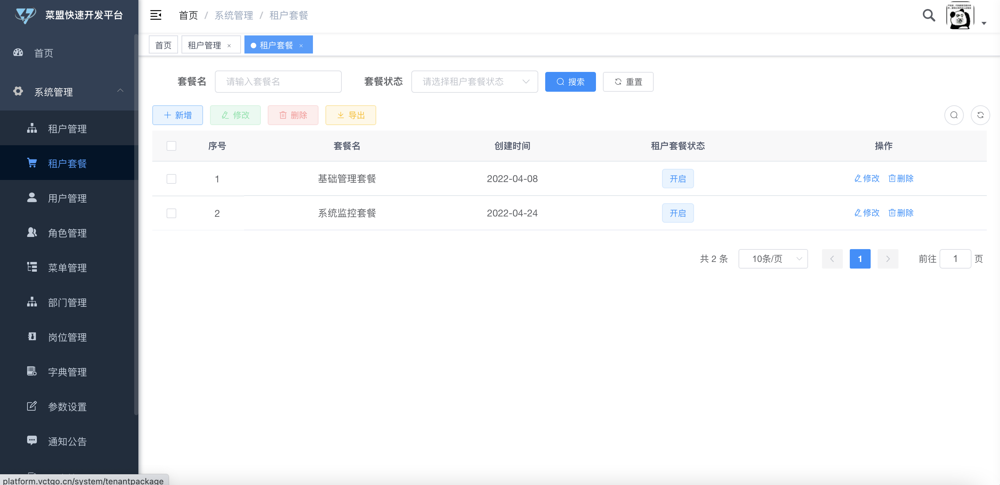
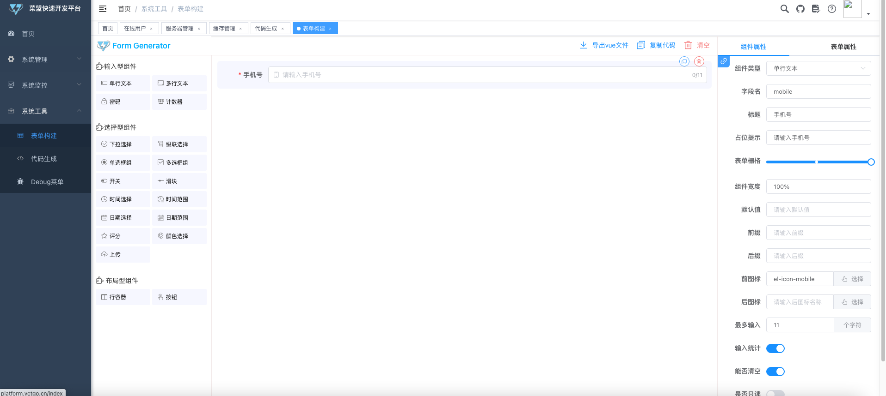
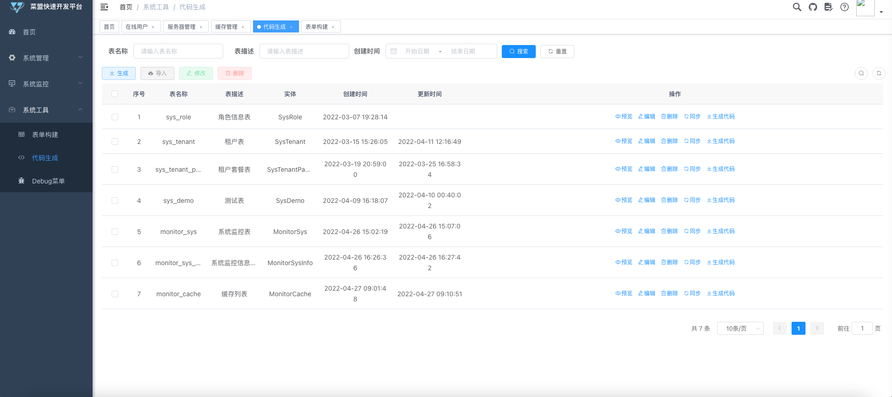

## 平台简介

<h1 align="center" style="margin: 30px 0 30px; font-weight: bold;">Vctgo-platform 多租户Saas快速开发平台</h1>
<h4 align="center">基于Ruoyi-Cloud版本改造的的多租户SaaS开发框架。</h4>

    
    
    
    
   
   

- 首先感谢若依提供的开源支持!请大家继续关注若依项目!

- 菜盟由来-菜鸟联盟,由当时我和2个好朋友一起拟定的名字 vct代表了我们三个菜鸟的字母,go 代表了我们要菜鸟起飞!

- 本项目基于 [RuoYi-Cloud](https://gitee.com/y_project/RuoYi-Cloud) 进行二次开发的租户版本,主要致力于租户模式和服务治理相关的部分。

- 本项目主要针对企业租户场景开发，脚手架功能同步更新  [RuoYi-Cloud](https://gitee.com/y_project/RuoYi-Cloud)  项目。

- 采用`MIT开源协议`，完全免费给个人及企业使用。

- 项目处于开发阶段，租户的数据权限,服务治理这块还存在一定的缺陷.后续的版本会优先优化此块。因此，目前仅推荐用于学习、毕业设计等个人使用。

#### 友情链接 [若依/RuoYi-Cloud](https://gitee.com/y_project/RuoYi-Cloud) Element UI版本。
star 别忘点上 :kissing_heart:
## 项目地址
Gitee: https://gitee.com/vctgo/vctgo-platform

GitHub: https://github.com/vctgo/vctgo-platform
## 演示地址
PS:目前已经改成流量计费满速100M,请大家切勿恶意刷流量
- http://platform.vctgo.cn
- 账号密码 admin/admin123
- 目前演示地址权限全开,请勿随意删除相关数据,本人只做了初始化数据库备份,如果出现异常情况,会选择直接回滚初始版本
## 文档地址
- https://doc.vctgo.cn
## 个人blog
- https://www.vctgo.cn
## 公众号-VctGo
- VctGo 全新公众号
## 有问题请issues有限提问,每天会定时处理!

## 交流
- 请移步右上角  **一键三连** :kissing_heart:
- 邮箱:dhr92@163.com
- Q群:628417588 (目前某500强企业搬砖,工作环境比较繁忙,上班期间可能无法回复相关问题)。

## 主要添加模块
- 1.添加了租户功能,包含自定义租户套餐,租户到期禁用登陆等功能
- 2.替代mybatis为mybatis-plus模块
- 3.添加了邮件通知功能
- 4.添加了自定义监控模块,暂时代替monitor模块
- 5.去除定时任务模块,选择了xxl-job,目前没有加入代码库
- 6.优化代码生成模块-代码生成默认集成mybatis-plus的CRUD模块
- 7.等待建议添加....
## 后续开发任务
- 1.继续同步RuoYi-Cloud相关版本性更新
- 2.优化租户增删改查时候的数据处理逻辑,以及租户到期提前一星期通知功能
- 3.完善租户模式下的数据权限问题(暂定通过行级字段管控)
- 4.集成阿里云,腾讯云等短信服务,并接入第三方登陆系统,增加短信登陆功能(优先完成短信验证码登陆功能)
- 5.监控功能添加数据库监控和表监控
- 6.集成K8S环境
- 7.集成链路追踪
- 8.集成普罗米修斯

## 启动说明
#### 1.nacos自行运行 如果是 M1的芯片 会出现内核报错 采用下方nacos镜像即可  docker pull zhusaidong/nacos-server-m1:2.0.3
     - 运行指令如下 
     docker run --name nacos-standalone -e MODE=standalone -e JVM_XMS=512m -e JVM_XMX=512m -e JVM_XMN=256m -p 8848:8848 -d zhusaidong/nacos-server-m1:2.0.3
     
- 非M1芯片或者非docker环境请自行参考文档里的相关部署说明
    
#### 2.mysql,redis等自行安装根据需求修改配置文件里的端口和连接,目前nacos初始化的配置文件里写的地址都是host映射的地址,如果需要指定指定地址请自行修改
     - Windows处于 C:\Windows\System32\drivers\etc
     - Linux和Mac都属于 /etc/hosts下
     
     主要添加以下几个部分,不理解的自行百度,其中127.0.0.1为你自己的本机ip
     vctgo-platform 127.0.0.1
     vctgo-nginx 127.0.0.1
     vctgo-nacos 127.0.0.1
     vctgo-mysql 127.0.0.1
     vctgo-gateway 127.0.0.1
     vctgo-auth 127.0.0.1
     vctgo-system 127.0.0.1
     vctgo-file 127.0.0.1
     vctgo-gen 127.0.0.1
     vctgo-monitor 127.0.0.1
     vctgo-redis 127.0.0.1

#### 3.前后端启动说明
     - 1.nacos和mysql以及redis正常运行后 优先启动gateway网关和 auth服务,其他的就可以同时启动了
     - 2.前段部分,记得修改vue.config里的后端接口地址

## 一键式体验(要求linux环境)
##### 1.docker安装和docker-compose安装请参考文档里的-应用容器部署模块进行安装
##### 2.安装完成后下载项目到任意文件夹目录,自行安装 maven,jdk,node环境 下面简单提供三个教程链接仅供参考
 - [Centos7安装JDK8](https://www.vctgo.cn/archives/centos7-an-zhuang-jdk18-tu-wen-jiao-cheng)
 - [Centos7安装maven](https://www.vctgo.cn/archives/centos7-an-zhuang-maven)
 - [Centos7安装nodejs14](https://www.vctgo.cn/archives/centos7-an-zhuang-nodejs14)
##### 3.脚本执行
      - 1.cd ./docker 目录下 执行 copy.sh 脚本会自动进行打包编译和copy
      - 2.首先执行 sh deploy.sh base 命令进行 nacos,mysql,redis的初始化,初始化完成后建议等待10秒后执行查下一步
      - 3.后面执行 项目脚本 sh deploy.sh modules ,如果防火墙没有关闭 还可以执行port指令请自行研究脚本
      - 4.执行copy脚本前可以根据自己的需求自行替换相关变量 比如初始变量设置了 192.168.200.188这个虚拟机ip 可以根据需要自行全局替换

## 功能截图

## 系统模块

~~~
com.vctgo     
├── vctgo-ui              // 前端框架 [80]
├── vctgo-gateway         // 网关模块 [38080]
├── vctgo-auth            // 认证中心 [39200]
├── vctgo-api             // 接口模块
│       └── vctgo-api-system                          // 系统接口
├── vctgo-common          // 通用模块
│       └── vctgo-common-core                         // 核心模块
│       └── vctgo-common-datascope                    // 权限范围
│       └── vctgo-common-datasource                   // 多数据源
│       └── vctgo-common-log                          // 日志记录
│       └── vctgo-common-redis                        // 缓存服务
│       └── vctgo-common-security                     // 安全模块
│       └── vctgo-common-swagger                      // 系统接口
│       └── vctgo-common-message                      // 消息通知
│       └── vctgo-common-mybatisplus                  // mybatis增强组件
├── vctgo-modules         // 业务模块
│       └── vctgo-system                              // 系统模块 [39201]
│       └── vctgo-gen                                 // 代码生成 [39202]
│       └── vctgo-file                                // 文件服务 [39300]
├── vctgo-visual          // 图形化管理模块
│       └── vctgo-visual-monitor                      // 监控中心 [39100]
├──pom.xml                // 公共依赖
~~~

## 内置功能

1. 租户管理：配置系统租户，支持 SaaS 场景下的多租户功能。
2. 配置租户套餐：自定每个租户的菜单、操作、按钮的权限。
3. 用户管理：用户是系统操作者，该功能主要完成系统用户配置。
4. 部门管理：配置系统组织机构（公司、部门、小组），树结构展现支持数据权限。
5. 岗位管理：配置系统用户所属担任职务。
6. 菜单管理：配置系统菜单，操作权限，按钮权限标识等。
7. 角色管理：角色菜单权限分配、设置角色按机构进行数据范围权限划分。
8. 字典管理：对系统中经常使用的一些较为固定的数据进行维护。
9. 参数管理：对系统动态配置常用参数。
10. 通知公告：系统通知公告信息发布维护。
11. 操作日志：系统正常操作日志记录和查询；系统异常信息日志记录和查询。
12. 登录日志：系统登录日志记录查询包含登录异常。
13. 在线用户：当前系统中活跃用户状态监控。
14. 代码生成：前后端代码的生成（java、html、xml、sql）支持CRUD下载 。
15. 系统接口：根据业务代码自动生成相关的api接口文档。
16. 服务监控：监视当前系统CPU、内存、磁盘、堆栈等相关信息。
17. 在线构建器：拖动表单元素生成相应的HTML代码。

